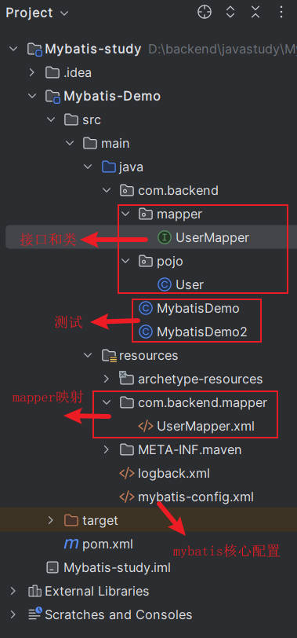

## Mybatis技术总结

>第一步：[构建maven项目](#one)
>
>第二步：[pom.xml文件配置](#two)
>
>第三步：[mybatis-config核心配置](#three)
>
>第四步：[构建对应Mapper.xml](#four)
>
>第五步：[创建映射类](#five)
>
>第六步：[编译运行接收数据](#six)
>
>第七步：[项目大致结构](#seven)

### <a name="one">第一步：构建maven项目</a>

1、打开IDEA，创建一个空工程，进入。
2、在project structure中创建model为maven项目。
3、maven项目下的Demo文件中，在main中如果不存在java文件夹，创建名为java的文件夹，内部创建com.(项目或者企业名称).pojo类。

### <a name="two">第二步：pom.xml文件配置</a>

主要配置为导入对应依赖

```xml
 <dependencies>
		<!--各个依赖的版本在maven repository中查询并找到对应写法引入-->
        <!-- mybatis -->
        <dependency>
            <groupId>org.mybatis</groupId>
            <artifactId>mybatis</artifactId>
            <version>3.5.5</version>
        </dependency>
        <!-- mysql 驱动 -->
        <dependency>
            <groupId>mysql</groupId>
            <artifactId>mysql-connector-java</artifactId>
            <version>5.1.32</version>
        </dependency>
        <!--junit 单元测试-->
        <dependency>
            <groupId>junit</groupId>
            <artifactId>junit</artifactId>
            <version>4.13</version>
            <scope>test</scope>
        </dependency>

        <!-- 添加slf4j日志api -->
        <dependency>
            <groupId>org.slf4j</groupId>
            <artifactId>slf4j-api</artifactId>
            <version>1.7.20</version>
        </dependency>
        <!-- 添加logback-classic依赖 -->
        <dependency>
            <groupId>ch.qos.logback</groupId>
            <artifactId>logback-classic</artifactId>
            <version>1.2.3</version>
        </dependency>
        <!-- 添加logback-core依赖 -->
        <dependency>
            <groupId>ch.qos.logback</groupId>
            <artifactId>logback-core</artifactId>
            <version>1.2.3</version>
        </dependency>	

    </dependencies>
```

### <a name="three">第三步：mybatis-config核心配置</a>

在工程文件下的resource目录下创建mybatis-config.xml文件，写入如下配置：

```xml
<?xml version="1.0" encoding="UTF-8" ?>
<!DOCTYPE configuration
  PUBLIC "-//mybatis.org//DTD Config 3.0//EN"
  "http://mybatis.org/dtd/mybatis-3-config.dtd">
<configuration>
  <environments default="development">
    <environment id="development">
      <transactionManager type="JDBC"/>
      <dataSource type="POOLED">
        <property name="driver" value="com.mysql.jdbc.Driver"/>
        <property name="url" value="jdbc:mysql:///mybatis?useSSL=false"/>
        <property name="username" value="数据库名"/>
        <property name="password" value="数据库密码"/>
      </dataSource>
    </environment>
  </environments>
  <mappers>
      <!--添加mapper映射-->
    <mapper resource="org/mybatis/example/BlogMapper.xml"/>
  </mappers>
</configuration>
```

此时，带有http的资源可能会发生报错，显示无法找到资源，此时只需要在Settings中的语言和框架下的DTDs中添加这段资源就行。

### <a name="four">第四步：构建Mapper.xml</a>

在resource中创建需要的映射xml文件，写入如下配置：

```xml
<?xml version="1.0" encoding="UTF-8" ?>
<!DOCTYPE mapper
  PUBLIC "-//mybatis.org//DTD Mapper 3.0//EN"
  "http://mybatis.org/dtd/mybatis-3-mapper.dtd">
<mapper namespace="便于区分的命名空间">
  <select id="标识" resultType="返回类型">
      <!--操作数据库的sql语句-->
    select * from table_name where 条件
  </select>
</mapper>
```

这里的资源不出意外依然会报红，具体解决方案同上。

### <a name="five">第五步：创建映射类</a>

在之前创建好的pojo类中创建一个接收映射类，类中定义数据成员和对应get/set方法
此时，上述的Mapper中的返回类型声明为com.().pojo.类名，至此，映射类构建完成。

### <a name="six">第六步：编译运行接收数据</a>

在java文件夹下创建Demo类，具体如下：

```java
import com.backend.pojo.User;
import org.apache.ibatis.io.Resources;
import org.apache.ibatis.session.SqlSession;
import org.apache.ibatis.session.SqlSessionFactory;
import org.apache.ibatis.session.SqlSessionFactoryBuilder;
import java.io.IOException;
import  java.io.InputStream;
import java.util.List;
//导入需要的包
public class MybatisDemo{
    public static void main(String[] args){
        String resource = "mybatis-config.xml";
InputStream inputStream = Resources.getResourceAsStream(resource);
SqlSessionFactory sqlSessionFactory = new SqlSessionFactoryBuilder().build(inputStream);
        
        SqlSession session = sqlSessionFactory.openSession();//打开资源
        //操作数据语句，调用session下的方法即可
        
    }
}
```

### <a name="seven">第七步：项目大致结构</a>

这是加入Mapper代理后的项目基本结构，如下图所示：



